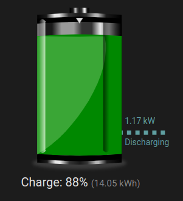

# Home Assistant Lovelace Battery Entity Card

This card is a custom lovelace entity card for Home Assistant that displays the state of a battery, including
the state of charge (SOC), discharge and charge power.

It's currently in a pretty early stage and it's my first foray into HA card creation, so it's a bit rough around the 
edges and there's plenty to do.

## Installation

Can be installed via HACS by adding the repository URL to the custom repositories in HACS.

## TODO:

* (done) Convert to Typescript
* (done) Work out how to add to HACS
* Add colour staging configuration
* Add toggle options for some of the display elements
* Add SOC in the battery itself
* Add option to have charge cable on the right
* i18n
