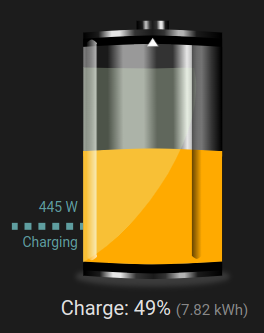
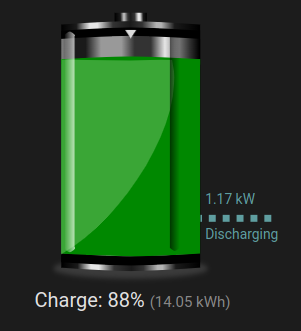

# Home Assistant Lovelace Battery Entity Card

[](https://github.com/hacs/integration)

This card is a custom lovelace entity card for Home Assistant that displays the state of a battery, including
the state of charge (SOC), discharge and charge power.

It's currently in a pretty early stage and it's my first foray into HA card creation, so it's a bit rough around the
edges and there's plenty to do.




## Installation

Can be installed via HACS by adding the repository URL to the custom repositories in HACS.

## Options

| Name             | Type   | Default      | Description                                                               |
|------------------|--------|--------------|---------------------------------------------------------------------------|
| socEntity        | sensor | **required** | The sensor that provides the state of charge of the battery in percentage |
| kWhEntity        | sensor |              | The sensor that provides the state of charge of the battery in kWh        |
| dischargeWEntity | sensor |              | The sensor that provides the discharge power of the battery in W          |
| chargeWEntity    | sensor |              | The sensor that provides the charge power of the battery in W             |
| sizePx           | number | 200          | The preferred height of the card in pixels                                |
| colours          | string |              | The colours to use for the battery states. See below for details          |

### Battery State Colours

The colour option is a string that defines the colours to use for the battery states.
It's a comma separated list of pairs, where the pair is separated by a colon. The first
part of the pair is the maximum value that the colour will be shown, while the second
part of the pair is colour to show.

For example:
```
25:#aa0000
```
represents that a red colour (#aa0000) will be shown when the SOC is less than 25%.

The order is important and needs to be from lowest to highest.

The default is `25:#aa0000,50:#ffaa00,100:#008800` which represents
red up to 25%, orange up to 50% and green up to 100%.

## TODO:

* (done) Convert to Typescript
* (done) Work out how to add to HACS
* Start using semver releases
* Add support for single charge/discharge sensor
* Add robustness against missing sensors
* Add toggle options for some of the display elements
* Add SOC in the battery itself
* Add option to have charge cable on the right or discharge cable on left
* Add colour configuration
* Adjust speed of ants based on dis/charge power
* i18n
* Add sources/sinks for charge/discharge

## Credits

The original battery image is public domain sourced here https://freesvg.org/three-battery-levels
